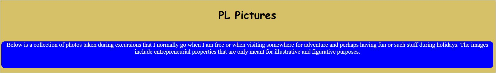
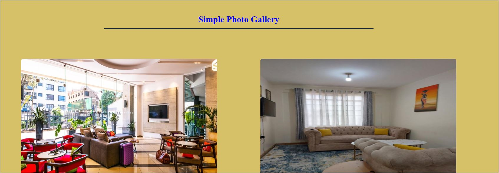

# PHOTOGRAPHY WEBSITE

# Description

Below is a simple website that contains a collection of photos/pictures that are only for illustrative purposes though they are related to what should be presented.

The basic layout of the website is simplified to a column view to provide ease in viewing the photographs.

# Tools

The website is developed using two basics of web design that are:

- HTML

- CSS

# Pre-requisites

To successfully view the website, you must open the link on a Macbook Windows or Linux PC with a width of atleast 1428px.

# Screenshots

On visiting the website, the landing page will be as shown in the images below:






# Author

[Lekeni](https://github.com/Lekeni)

# Issues

The only known issue with the website is that the website is not fully responsive

# License

The project is issued under the MIT License

```
Copyright 2023 Praise Lekeni

Permission is hereby granted, free of charge, to any person obtaining a copy of this software and associated documentation files (the “Software”), to deal in the Software without restriction, including without limitation the rights to use, copy, modify, merge, publish, distribute, sublicense, and/or sell copies of the Software, and to permit persons to whom the Software is furnished to do so, subject to the following conditions:

The above copyright notice and this permission notice shall be included in all copies or substantial portions of the Software.

THE SOFTWARE IS PROVIDED “AS IS”, WITHOUT WARRANTY OF ANY KIND, EXPRESS OR IMPLIED, INCLUDING BUT NOT LIMITED TO THE WARRANTIES OF MERCHANTABILITY, FITNESS FOR A PARTICULAR PURPOSE AND NONINFRINGEMENT. IN NO EVENT SHALL THE AUTHORS OR COPYRIGHT HOLDERS BE LIABLE FOR ANY CLAIM, DAMAGES OR OTHER LIABILITY, WHETHER IN AN ACTION OF CONTRACT, TORT OR OTHERWISE, ARISING FROM, OUT OF OR IN CONNECTION WITH THE SOFTWARE OR THE USE OR OTHER DEALINGS IN THE SOFTWARE.
```


